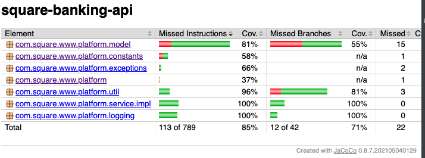

Overview
=========
This application has a test coverage of `85%`

Sample tests are located in the /src/test/java folder.
Sample tests resources are located in the /src/test/resource folder.

Testing the Application
======================

To test the app in dev environment, execute:

    mvn clean verify | mvn clean test

Unit Test Coverage
==================
Jacoco is provided to help gauge unit test coverage.

To create the Jacoco report, run the unit tests and then run:

    mvn verify jacoco:report

The report will be under the /target/site directory.

Current report:

  
   

